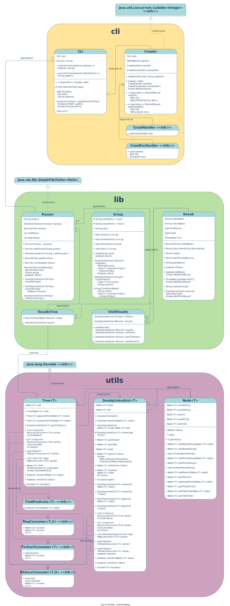

JSpec testing library
===

A final project by Andrew Chang-DeWitt for CSCI 24000 at IUPUI, Spring 2022.

A simple unit testing library for TDD & a cli for running tests.

- **Intended User:** Java developers to write & evaluate unit tests.
- **Problem solved:** Unit test writing & evaluation.
- **Technologies needed:** CLI commands, file i/0, programmatic/dynamic compilation, & output to stdout


Use Case Analysis
---

Features belong to one of three categories: definition, running, & discovery.

Defining features here via User stories. In this case, a User is defined as the person writing & running tests.

### Test definition

Encompasses features that are used to write, group, set up, & tear down tests.

- A User defines a group of tests as methods belonging to a class.
- A User describes a group of tests by giving a string description as the `desc` property on the class.
- A User describes a test method by declaring it with a descriptive name, beginning with the prefix `test`.
- A User can nest groups of tests by declaring a nested class.
- A User can define code that needs to be run once before executing a group of tests by defining a method called `before`.
- A User can define code that needs to be run before each test in a group of tests by defining a method called `beforeEach`.
- A User can define code that needs to be run once after executing a group of tests by defining a method called `after`.
- A User can define code that needs to be run after each test in a group of tests by defining a method called `afterEach`

### Test running

Encompasses features for executing tests, evaluating for success or failure, & communicating that state to the user.

- A User can run a test class (& any nested classes) manually by defining a main() method that creates an instance of itself & calls the instance's run() method.
- A User receives a concise indicator of test result status after running a test class with a '.' to indicate a successful test & an 'F' to indicate a failure.
- A User receives a count of successful tests out of total tests at the end of the report.
- A User receives a detailed report consisting of the test class name, followed by a list of test method names & success or failure indicators, depending on the result.
- A User receives details about any failed test, including the test class name, test method name, failure reason (exception name & message), & any stack trace.
- A User can opt to receive a concise output of test result status, skipping the printing of each test group or test method's text and status

### Test discovery

Encompasses features for recursively finding all tests in a given directory & running them.

- A User can use a cli command (e.g. `jspec test` or `maven test`) have jspec recursively traverse a given (could default to PWD or project) directory & subdirectories & discover any files ending in `Spec.java`, then run the tests for all files found.
- A User can give a glob pattern to use when searching for spec files, replacing the default `Spec.java` pattern.
- A User can specify a single test file to run.


Data design
---

- _What data is your program really about?_

  In this case, the 'data' in question is code: a test is simply code used to set up & declare a fact, then evaluate if it is true or not.
  So to that end, data starts as code, then is transformed to a 'Success' or 'Failure' statement by evaluating the test's assertions.

- _What is the best way to represent that data? (database, object, arrays)_

  The data will be represented as Objects defined by the User & inherited from an Object provided by this library.
  Each Object will contain tests defined as methods on the Object.

- _Will the data need to be persistent? How will you make that happen?_

  The only data persistence will be the tests defined by the User in `*.java` files. For the most simple use case, there won't be any File I/O, as the User will set up the test Object to be compiled & run using the Java compiler & runtime.
  In more complex use cases, the User may use a CLI provided by the library that will utilize File I/O APIs to "discover" tests & then evaluate them.

- _Will the data need to be aggregated into a larger structure?_

  In the simple use case, the User will handle aggregation by defining their own `Runner` Object with its own `main()` method that adds `Group`s to the `Runner` before evaluating the `Group`s.
  When using the CLI, the program will need to aggregate `Group`s into a `Runner` that is then used to evaluate the tests.
  In both cases, the `Runner` will provide two options for adding `Group`s: via the `Runner()` constructor during initialization, or by calling the `Runner.addGroup()` method after initialization.
  Internally, the `Runner` will aggregate `Group`s in an array or vector.
  During test evaluation, the collection will be traversed & the `Group`s will be inspected using `java.lang.reflect` APIs to discover all test methods & any nested `Group`s. As tests & test groups are discovered they could either be evaluated immediately, or have references to them stored in a tree that will later be traversed for the actual evaluation of each test.


UI Design
---

The main portion of the UI is the text output of test results.
This is mainly broken down into 4 parts:

1. A progress indicator (using `.` & `F` to represent a test's completion & result)
2. A failure result (detailed output regarding a failed test, incl. stack trace, error type/message, test-writer messaging, maybe even code snippets?)
3. Verbose status output (Using Group's descriptions & test descriptions to generate output as a series of nested lists)
4. Summary (a count of all tests, a count of passed tests)

Sample output for each part below.

### Progress indicator

```
.....F....F..F.....
```

### Failure result

```
================================================================================
❌ FAILURE: Some group name/description: Some test name/description
--------------------------------------------------------------------------------

SomeErrorType: An error message
  Some Method() nn:mm in SomeModule
  Some Method() nn:mm on SomeClass
  Some Method() nn:mm in SomeModule
  Some Method() nn:mm on SomeClass
  Some Method() nn:mm in SomeModule
  Some Method() nn:mm on SomeClass
  Some Method() nn:mm in SomeModule
  Some Method() nn:mm on SomeClass

```

### Verbose status report

Assume 4 Groups, A, B, C, & D.
C is nested in B, & B is nested in A; D is unrelated.

```
Group A description
  Some test description ✅
  Another test description ❌
  testATestMethodName ✅
  testSomeOtherTest ❌

    Group B description
      Some test description ✅
      Another test description ❌

      Group C description
        Some test description ✅
        testSomeOtherTest ✅

Group D description
  Some test description ✅
  Another test description ✅
  testATestMethodName ✅
  testSomeOtherTest ✅

```

### Summary

Some failure(s):

```
================================================================================

9/15 (60%) Passed

```

No failures:

```
================================================================================

15/15 (100%) Passed!

```


Algorithm
---

The program is strictly Object-Oriented with all code organized by classes.
A UML diagram is provided here, with more details about each class below it.



**OOP Relationships:**

- A User's test definition class extends Group
- A User's test runner class extends Runner
- One Group aggregates zero to many Group
- One Runner aggregates one to many Group
- One Node<Result> aggregates one Result
- One Node\<T\> aggregates zero to many Node\<T\>
- One Tree\<T\> aggregates one Node\<T\>
- ResultsTree extends Tree\<Result\>
- One Runner aggregates one ResultsTree
- One CLI aggregates one Runner
- One CLI composes one Crawler

### Group

A User creates a `Group` of tests by defining a new class that inherits from this class.
Nested groups are created by defining inner classes (that inherit from `Group`) inside a child of `Group`.
Most User stories belonging to the _**Test Definition**_ group above will be built as features on `Group`.

#### Properties

- _protected static String **desc**_: a property used to give a better description to a test group, defaults to null if not implemented in a child class

#### Methods

- _public **visit**() -> VisitResults_

  1. Get the `Class` object for this `Group` instance
  2. Get a list of methods for the instance
  3. Get a list of inner classes for the instance
  4. Return a new instance of VisitResults containing:
      1. A list of test results created using `Group.evaluate()`
      2. A list of inner Groups found using `Group.findChildren()`

- _private **evaluate**(
  Methods[] tests,
  Class<? extends Group> instanceClass,
  boolean silent) -> DoublyLinkedList<Result>_

  1. Create an empty list to store results
  2. Perform setup tasks using `this.before()`
  3. Loop over the given list of method:
      1. Create new `Result`
      2. If this `Group` has a non-null `desc` attribute, add it to the result
      3. Try the following:
          1. Perform per-test setup using `this.beforeEach()`
          2. Invoke the test method
          3. Perform per-test teardown using `this.afterEach()`
          4. Mark the result as a passed test
      4. Catch InvocationTargetException
          1. Mark result as a failed test with caught target exception
          2. If not silent:
              1. If caught exception was caused by an AssertionError, print an "F"
              2. Else print an "E"
      5. Cath IllegalAccessException
          1. Mark result as a failed test with caught exception
          2. If not silent print an "E"
  4. Perform teardown using `this.after()`
  5. Return the list of results

- _private **findChildren**(
  Class<?>[] nested,
  Group parent) -> DoublyLinkedList<Group>_

  1. Create an empty list to store children
  2. For each given nested class:
      1. If the nested class is a descendent of Group, try the following:
          1. Get the class's constructor & initialize an instance of it
          2. Append the instance to the list of children
      2. Catch IllegalAccessException, InvocationTargetException, InstantiationException, NoSuchMethodException exceptions:
          1. Print a helpful error message
          2. Print the exception

- Virtual functions:

  The following methods are defined as "virtual" functions that are all a no-op if not defined in a child class.
  Each is a method that will be called a different stage of test execution: once before _any_ tests are called, once before _each_ test method is called, once after _each_ test is called, & finally once after _all_ the tests are called.
  A child class can implement any or all of these to customize some behavior needed for all tests or perform some set-up or tear-down actions.

  - _public **before**() -> void_
  - _public **beforeEach**() -> void_
  - _public **afterEach**() -> void_
  - _public **after**() -> void_


### VisitResults

A simple data class that stores a list of `Group`s and a list of `Result`s.


### Runner

A User creates an instance of this to run any test `Group`s passed to it on creation, or by adding them to the `Runner` instance using the `addGroup()` method.

```java
import org.jspec.Runner;

class Runner extends Runner {
  public static void main(String[] args) {
    // Add test groups during Runner initialization
    Runner r = new Runner(GroupA, GroupB);

    // Add a group using Runner.addGroup()
    r.addGroup(GroupB);

    // run the tests in all groups given
    r.run();
  }
}
```

The CLI will work by auto-discovering test `Group`s in a directory & subdirectory, then creating a new `Runner` instance & giving all the found `Group`s to the new `Runner`.
Most likely, the User will never need to implement this class, but it's exposed if they would like to run their tests programmatically.

#### Properties

- _private DoublyLinkedList\<Group\> **groups**_: stores the groups to be evaluated by this `Runner`
- _private ResultsTree **results**_: stores the results after the groups are evaluated
- _int **totalTests**_: for counting the number of tests executed when running all the Groups' tests
- _int **failedTests**_: for counting the number of failed tests

#### Methods

- _public Constructor **Runner**(Group ... groups)_
- _public Constructor **addGroup**(Group group)_

  1. Build Runner containing the given `Group`(s)

- _public **run**() -> Runner_

  1. Create a `ResultsTree` on `this.results` with an empty root
  2. If not silent, print an empty line to pad output
  3. Loop over `this.groups` passing each group to `this.buildResults`

- _private **buildResults**(ResultsTree tree, Group group, boolean silent) -> void_

  1. Create a `Node` containing a `Result` made from this `Group`
  2. Add newly created `Node` to the given `ResultsTree`
  3. Call the `Group`'s visit method, storing the results
  4. Make a new `ResultsTree` pointing to the new `Node` created above as its root
  5. Loop over the test results from calling `visit()` above, adding each result as a child node to the newly created tree
  6. Loop over the children gotten from calling `visit()` above, calling `this.buildResults()` on each of them to continue building tree recursively
  7. Return the given tree


### Result

An abstract base class for defining a result value to store in a tree.
Defining shared properties & one shared method, all used to render the tree of values.

#### Properties

- _private String **codeName**_: the name of the method or class in the test code that this result is from
- _private String **descName**_: a more descriptive name given to this class or test method, may be null
- _private boolean **testResult**_: indicates if `Result` is for a `Group` or a test method
- _private boolean **pass**_: indicates if the test passed or not
- _private Throwable **exc**_: stores the exception thrown when a test failed

#### Methods

- _Constructor public **Result**(String codeName)_

  1. Set `this.codeName` to given string
  2. Set as not a test result

- _public **describe**(String description) -> Result_

  1. Set `this.descName` to given string
  2. Return this

- _public **pass**() -> Result_

  1. Mark result as passed
  2. Mark result as being for a test
  3. Return this

- _public **fail**(Throwable exc) -> Result_

  1. Mark result as failed
  2. Mark result as being for a test
  3. Set `this.exc` to given exception
  4. Return this

- _public **statusString**(String prefix) -> String_

  1. Create a result string, starting with the name from `this.getName()`
  2. If `Result` is for a test, append with a ✅ or ❌ indicating it passed or failed
  3. Prepend with given prefix & return

- _public **failureStrings**(String prefix) -> DoublyLinkedList\<String\>_

  1. If `Result` is a test, create a new `DoublyLinkedList` of Strings
      1. Then append it with two empty lines
      2. Then a line of "="
      3. Then "❌ FAILURE:" followed by the `Result`s name
      4. Then a line of "-"
      5. Then the `this.exc`'s String representation
      6. Then `this.exc`'s stack trace lines
      7. And finally an empty line
  2. Else, throw an error

Getters:

- _public **getName**() -> String_
- _public **getCodeName**() -> String_
- _public **getDescription**() -> String_
- _public **getFailureExc**() -> Throwable_
- _public **didPass**() -> boolean_
- _public **isTest**() -> boolean_


### Node\<T\>

Encapsulates logic for building a collection of nodes.

#### Properties

- _private T **value**_: the actual value object
- _private Node\<T\> **parent**_: a reference to the parent of this node, will be null if this is a root node
- _private Node\<T\> **headChild**_: a reference to one end of the list of child nodes (child nodes are represented as a doubly linked list), will be null if this is a leaf node
- _private Node\<T\> **tailChild**_: a reference to the other end of the list of child nodes (child nodes are represented as a doubly linked list), will be null if this is a leaf node
- _private Node\<T\> **nextSibling**_: a reference to the next sibling of this node (siblings a linked list), will be null if this is the tail child
- _private Node\<T\> **prevSibling**_: a reference to the previous sibling of this node (siblings a linked list), will be null if this is the head child

#### Methods

- _Constructor public **Node**(T value)_

  1. Assign `value` to `this.value`

- Builder pattern:

  These methods all implement a Builder Pattern for creating new nodes.
  First the creator calls the constructor with the desired value, then sets any parent, child, or sibling nodes using the appropriate method below.
  These method calls can be chained, as they all return the instance of `Node<T>` after adding the given parent/child/sibling node.

  - _public **addParent**(Node\<T\> node) -> Node\<T\>_
  - _public **addHeadChild**(Node\<T\> node) -> Node\<T\>_
  - _public **addTailChild**(Node\<T\> node) -> Node\<T\>_
  - _public **addNextSibling**(Node\<T\> node) -> Node\<T\>_
  - _public **addPrevSibling**(Node\<T\> node) -> Node\<T\>_

- Getters:

  These methods are all simple getters for the associated private property.

  - _public **getParent**() -> Node\<T\>_
  - _public **getHeadChild**() -> Node\<T\>_
  - _public **getTailChild**() -> Node\<T\>_
  - _public **getNextSibling**() -> Node\<T\>_
  - _public **getPrevSibling**() -> Node\<T\>_

- Deleters:

  These methods set the `Node`'s referenced sibling to `null`.
  Additionally, they edit the previously referenced sibling to remove its reference to this `Node`—e.g. if `A` has `B` as a next sibling, then calling `A.removeNextSibling()` will set `A`'s next sibling to `null` & `B`'s previous sibling to `null` as well.

  - _public **removeNextSibling**() -> void_
  - _public **removePrevSibling**() -> void_

- Setters: There is currently no use case where setters will be needed as the Results Tree is build & never modified.


### Tree\<T\>

Encapsulates logic for traversing & manipulating a tree via a reference to the root node.

#### Properties

- _private Node\<T\> **root**_

#### Methods

- _public **Tree**(Node\<T\> node) -> Tree\<T\>_

  Create a tree with the given root node.

- _public **appendChild**(Node\<T\> node) -> Tree\<T\>_
- _public **prependChild**(Node\<T\> node) -> Tree\<T\>_

  Append/Prepend given `Node` to the root's list of children.

- _public **getChildren**(Node\<T\> node) -> DoublyLinkedList\<T\>_

  Return a list of the root node's children.

- _public <U> **reduce**(
  ReduceConsumer<T,U> action,
  U initialValue) -> U_

  Traverses the tree with a pre-order algorithm, executing the given `ReduceConsumer` for each node & returning the new data structure.

  1. Call `this.reducer()` with given `ReduceConsumer`, initial value, & a starting depth of 0.

- _public <U> **reducer**(
  ReduceConsumer<T,U> action,
  U accumulator,
  int depth) -> U_

  1. Call given `ReduceConsumer.accept()` on `this.root` with the given accumulator & depth, saving the result as an updated accumulator
  2. Reduce the list from calling `this.getChildren()`, doing the following for each `Node`:
      1. Create a new `Tree` with the node as it's root
      2. Call the new tree's `reducer` method with the given action, the updatedaccumulator, & the current depth + 1

- _public **forEach**(ForEachConsumer<T> action) -> void_

  Loops over the tree in a pre-order traversal, executing the given `ForEachConsumer` for each node. Uses `this.reduce()` to reuse the pre-order logic.

- _public <U> **map**(MapConsumer<T,U> action) -> Tree\<U\>_

  Loops over the tree in a pre-order traversal, executing the given `MapConsumer` for each node to build a new `Tree` with the result of each call.

  1. Create an object to track the relationships of previously traversed nodes relative to the current node
  2. Call `this.reduce`, doing the following for each node:
      1. Call the given consumer on the current node's value, creating a new node from the result
      2. If there was no previous node:
          1. Push the current node to the stack of parent nodes
          2. Save this node as the new previous node
          3. And make a new Tree with this node as the root
      3. Else if the current node's depth is greater than the previous node's depth:
          1. Set previous node depth to the current node depth
          2. Push the previous node to the stack of parent nodes
          3. Create a new tree from the previous node & append the current node as a child
      4. Else if the current node's depth is equal to the previous node's:
          1. Get the tree with the parent node at the top of the stack as it's root, then append the current node as a child node
      5. Else if the current node's depth is less than the previous node's depth:
          1. Then pop nodes off the stack of parent nodes until we've returned to the current depth
          2. Get the tree with the new parent node at the top of the stack as it's root, then append the current node as a child node
      6. Return the tracker object to be used when processing the next node
  3. Return the tree stored in the tracker object

- _public **find**(FindPredicate<T> predicate) -> Node\<T\>_

  Returns the first node (using a pre-order traversal) that satisfies the given predicate.
  Uses `this.reduce` to reuse the traversal logic.

- _public **find**(T value) -> Node\<T\>_

  Returns the first node (using a pre-order traversal) that matches the given value.

- _public **contains**(T value) -> boolean_

  Returns true if the Tree contains a node with the given value.

- _public **iterator**() -> Iterator\<T\>_

  Returns an `Iterable\<T\>` from the given tree that follows a pre-order traversal.


### Crawler

Encapsulates logic for crawling the project file tree for test definition files & getting the defined `Group` descendants from them.
Extends `java.nio.file.SimpleFileVisitor`.

#### Properties

- _private File **start**_: the file to start crawling the file tree at
- _private PathMatcher **pattern**_: the pattern to match files to
- _private CrawlHandler **handler**_: a function to execute if a file matches the pattern
- _private CrawlExcHandler **excHandler**_: a function to execute if there's an error processing a file

#### Methods

- _Constructor public **Crawler**(File start, String pattern)_

  1. Save start file
  2. Get `PathMatcher` from given pattern string

- _public **crawl**(
  CrawlHandler handler,
  CrawlExcHandler excHandler) -> Crawler_

  1. Set properties to given handlers
  2. Use `java.nio.file.Files.walkFileTree` to walk file tree starting at `this.start` & using this `Crawler` object as the `FileVisitor`

- _\<\<override\>\> public **visitFile**(
  Path file,
  BasicFileAttributes attrs) -> FileVisitResult_

  If file path matches `this.pattern`, call `this.handler` on given file.

- _\<\<override\>\> public **visitFileFailed**(
  Path file,
  IOException exc) -> FileVisitResult_

  Call `this.excHandler` w/ given path & exception.


### CLI

Main entry point for the command line interface program.
Encapsulates logic to receive commands & arguments, then dispatches commands & composes results accordingly.
Implements the `Callable` interface & uses [remkop/picocli](https://github.com/remkop/picocli) to build CLI features.

#### Properties

- _File **cwd**_: the current working directory
- _Runner **runner**_: an instance of `Runner`
- _boolean **concise**_: a flag for concise vs verbose output
- _String **pattern**_: the search pattern for finding test files, defaults to "\*\*/\*Spec.java"

#### Methods

- _public static **main**(String[] args) -> void_

  1. Run the CLI with given args using `picocli.CommandLine.execute(args)`
  2. System exit code to resulting int

- _Constructor public **CLI()**_

  1. Init an empty Runner()
  2. Get current working directory from `System`

- _public **call**(String[] args) -> int_

  1. Start tracking time
  2. Discover & compile test classes w/ `this.discover`
  3. Mark compile time duration
  4. Run tests
  5. Mark run time duration & total time duration
  6. Report times to user
  7. Return 0 to indicate success

- _private **discover**(File start, String pattern) -> void_

  1. Create an empty list to store paths to test files
  2. Init a `Crawler` with cwd & given pattern
  3. Then initiate crawl with success handler that adds a matching file to the list & an error handler that indicates there was an error processing a given file
  4. Compile and initialize test `Group`s using `this.compileAndInitFiles`, then add each initialized `Group` to `this.runner`
  5. Catch and report errors thrown while crawling file tree

- _private **compileAndInitFiles**(ArrayList<Path> paths) -> ArrayList\<Group\>_

  1. Set up compiler & java file manager
  2. Get list of source File objects from given paths
  3. Compile files
  4. Loop over given list of paths:
    1. Get the fully qualified name for each path's class
    2. Initialize the class from the fqn
    3. Add the initialized `Group` to the list of Groups to return

- _private **run**() -> void_

  1. Run all `Group`s in `this.runner`
  2. Loop over `this.runner.resultStrings()` to print each line


240 Concepts Used
---

**OOP:**

- Inheritence - `ResultsTree` -|> `Tree\<Tree\>`
- Encapsulation
- Polymorphism
- Abstraction

**Data structures:**

- ArrayList
- Doubly Linked List
- Stack
- n-ary Tree

**Algorithms:**

- pre-order tree traversal
- functional collection transformation (i.e. map, reduce, forEach)
- file-tree traversal


© Andrew Chang-DeWitt 2022
